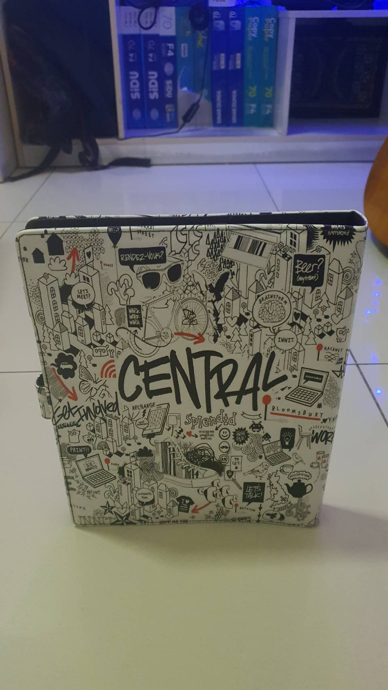
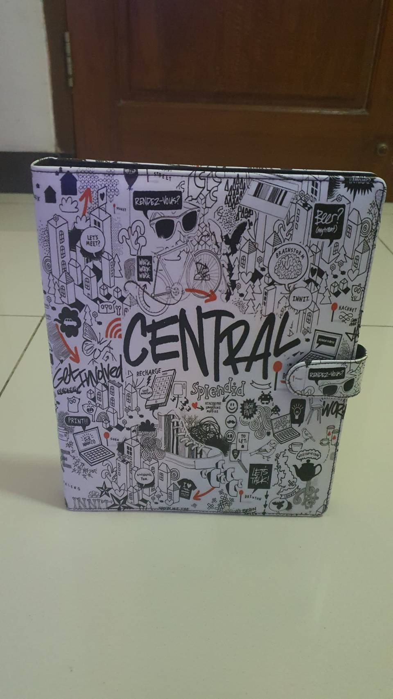
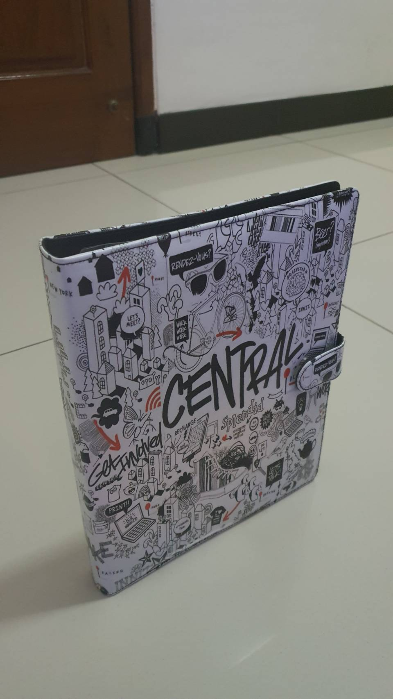
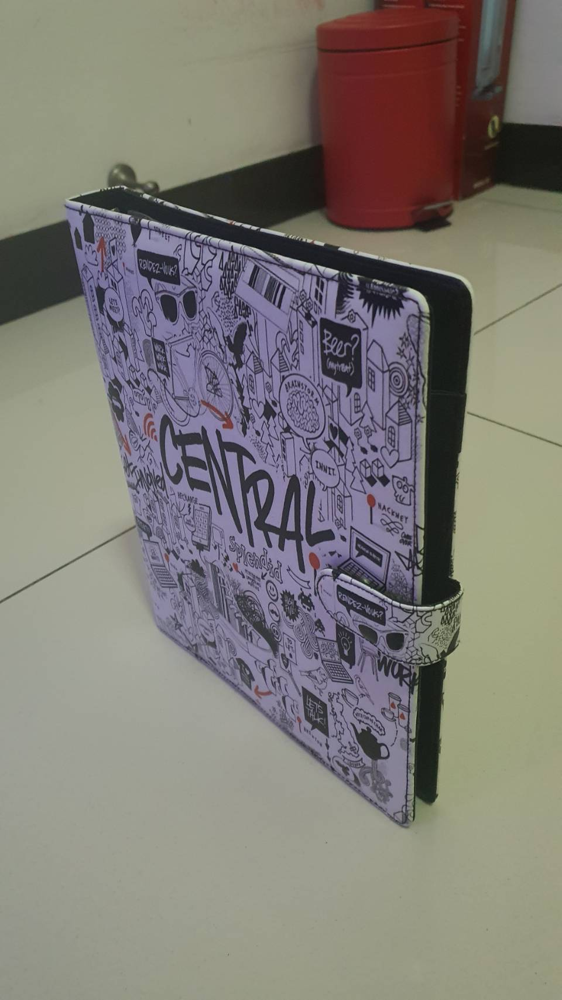

## tugas-1

**Nama**: Dyandra Paramitha Widyadhana 
**NRP**: 05111940000119

### Penugasan
Pada tugas kali ini kita diminta untuk mencari benda disekitar yang berawalan B, G, atau L. Dan saya mendapatkan bendanya yaitu "Buku Binder". Berikut ini adalah foto yang saya ambil dari binder tersebut. 

### Foto dari Belakang Atas

### Foto dari Depan Atas

### Foto dari Kiri Atas

### Foto dari Kanan Atas
